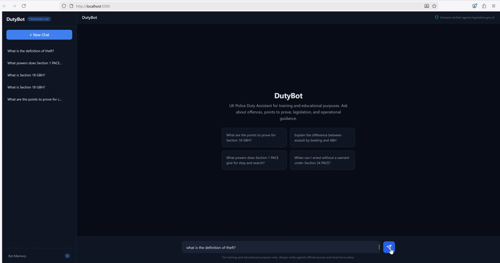
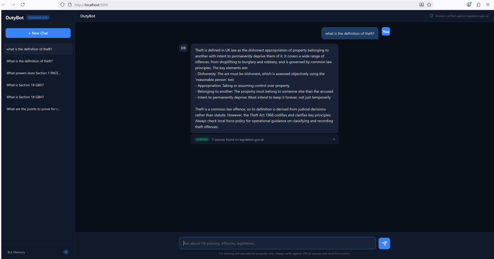

<div align="center">

# DutyBot

**UK Police Duty Assistant**

A fully self-hosted AI chatbot for police training and education.
Offences, points to prove, PACE powers, legislation lookups — all running locally with zero cloud dependencies.

[](https://creativecommons.org/licenses/by-nc-nd/4.0/)
[](https://docs.docker.com/compose/)
[](https://huggingface.co/EryriLabs/dutybot-GGUF)

---

**[Quick Start](#quick-start) | [Features](#features) | [Architecture](#architecture) | [Configuration](#configuration) | [Model](#the-model)**



</div>

> **Training and educational use only.** DutyBot must not be used for live operational decision-making. Always verify guidance against local force policy and official sources.

## Quick Start

**Prerequisites:** [Docker Desktop](https://www.docker.com/products/docker-desktop/) v24+ with Compose v2

```bash
git clone https://github.com/dwain-barnes/dutybot.git
cd dutybot
```

### CPU (works on any machine)

```bash
docker compose up --build
```

### NVIDIA GPU (faster inference)

```bash
docker compose --profile cuda up --build --scale llama-server=0
```

Then open **http://localhost:5000**

The GGUF model (~15GB) downloads automatically on first launch and is cached in a Docker volume for subsequent runs.

## Features



### Chat Interface
- Dark, professional UI designed for police use
- Message bubbles with basic markdown rendering (bold, code, lists)
- Quick-start example questions on the welcome screen
- Mobile-responsive layout with collapsible sidebar

### Automatic Verification
- Every answer is automatically verified against legislation.gov.uk
- Searches [SearXNG](https://github.com/searxng/searxng) in the background after each response
- Displays a collapsible "Verified" panel with matching legislation sources
- Click to expand and see source titles, URLs, and snippets

### Conversation History
- Conversations persist in SQLite across container restarts
- Sidebar lists all past chats, click to resume
- Delete individual conversations or start fresh

### Bot Memory
- DutyBot extracts key facts from conversations (rank, force, specialisation)
- Memories persist across chats and sessions
- View, manage, and clear memories from the sidebar panel

### GPU Acceleration
- **CPU mode** (default): runs on any machine — `docker compose up`
- **CUDA mode**: full GPU offload on NVIDIA cards — `docker compose --profile cuda up`
- Automatic detection and configuration via the entrypoint script

## Architecture

```
┌──────────────────────────────────────────────────────────┐
│  Docker Compose                                          │
│                                                          │
│  ┌────────────────────────────────────────────────────┐  │
│  │  DutyBot App (Flask)                     :5000     │  │
│  │  Chat UI + API + SQLite + Memory                   │  │
│  └──────────┬─────────────────────┬───────────────────┘  │
│             │                     │                       │
│             v                     v                       │
│  ┌──────────────────┐  ┌──────────────────┐              │
│  │  llama.cpp       │  │  SearXNG         │              │
│  │  GGUF inference  │  │  Meta search     │              │
│  │  :8080           │  │  :4000           │              │
│  └──────────────────┘  └──────────────────┘              │
└──────────────────────────────────────────────────────────┘
```

| Service | Image | Port | Role |
|---------|-------|------|------|
| **DutyBot** | Custom (Python 3.11-slim) | 5000 | Web UI, chat API, memory, conversations |
| **llama.cpp** | `ghcr.io/ggml-org/llama.cpp:server[-cuda]` | 8080 | GGUF model inference (OpenAI-compatible) |
| **SearXNG** | `searxng/searxng:latest` | 4000 | Legislation verification via meta search |

## Configuration

All settings are in `.env`:

| Variable | Default | Description |
|----------|---------|-------------|
| `MODEL_REPO` | `EryriLabs/dutybot-GGUF` | HuggingFace repository |
| `MODEL_FILE` | `domain_adapted-Q4_K_M.gguf` | GGUF filename to download |
| `CTX_SIZE` | `4096` | Context window size |
| `N_GPU_LAYERS` | `999` | GPU layers for CUDA mode |
| `DUTYBOT_PORT` | `5000` | Web UI host port |
| `LLAMA_PORT` | `8080` | llama.cpp host port |
| `SEARXNG_PORT` | `4000` | SearXNG host port |
| `MAX_CONTEXT_MESSAGES` | `20` | Max messages sent to the model per turn |

## Project Structure

```
.
├── docker-compose.yml           # Orchestrates all services
├── .env                         # Configuration
├── dutybot/                     # Main application
│   ├── Dockerfile
│   ├── requirements.txt
│   ├── app.py                   # Flask backend (chat, memory, conversations)
│   ├── templates/
│   │   └── index.html           # Chat UI
│   └── static/
│       ├── style.css            # Dark theme styles
│       └── app.js               # Frontend logic
├── llama-server/
│   ├── Dockerfile               # Fallback build (not used by default)
│   └── entrypoint.sh            # Downloads GGUF + launches server
└── searxng/
    └── settings.yml             # JSON format enabled
```

## The Model

DutyBot uses a domain-adapted version of [GPT-OSS 20B](https://huggingface.co/unsloth/gpt-oss-20b), fine-tuned on UK criminal law.

| | |
|---|---|
| **Base model** | unsloth/gpt-oss-20b |
| **Architecture** | Mixture of Experts (21B total, 3.6B active) |
| **Training method** | QLoRA continued pretraining (rank 64) |
| **Training corpus** | 10,511 chunks (~10.7M tokens) of UK criminal law |
| **Training loss** | 3.90 → 1.73 |
| **Quantisation** | Q4_K_M (GGUF) |
| **File size** | ~14.7 GB |
| **Hardware** | 2x NVIDIA RTX 3090 |

The corpus covers criminal offences, points to prove, PACE codes of practice, sentencing guidelines, CPS charging standards, and general operational policing knowledge.

Model weights: [EryriLabs/dutybot-GGUF on HuggingFace](https://huggingface.co/EryriLabs/dutybot-GGUF)

## API Endpoints

The Flask backend exposes a simple REST API:

| Method | Endpoint | Description |
|--------|----------|-------------|
| `GET` | `/api/health` | Health check |
| `GET` | `/api/conversations` | List all conversations |
| `POST` | `/api/conversations` | Create a new conversation |
| `DELETE` | `/api/conversations/:id` | Delete a conversation |
| `GET` | `/api/conversations/:id/messages` | Get messages for a conversation |
| `POST` | `/api/chat` | Send a message and get a response |
| `GET` | `/api/memory` | List all bot memories |
| `DELETE` | `/api/memory/:key` | Delete a specific memory |
| `DELETE` | `/api/memory` | Clear all memories |

### Chat request

```json
POST /api/chat
{
  "conversation_id": "optional-uuid",
  "message": "What are the points to prove for Section 18 GBH?"
}
```

The response includes a `verification` object with legislation.gov.uk sources that confirm the answer.

## Troubleshooting

| Problem | Solution |
|---------|----------|
| Model download fails | Check internet connection. The entrypoint retries automatically. You can also pre-download with `huggingface-cli download EryriLabs/dutybot-GGUF domain_adapted-Q4_K_M.gguf` |
| llama.cpp container keeps restarting | Check logs with `docker logs dutybot-llama-cuda`. Common causes: corrupted GGUF (re-download), insufficient RAM, or CUDA driver mismatch |
| Out of memory | Reduce `CTX_SIZE` in `.env` or use CPU mode which pages to disk |
| CUDA not detected | Ensure [NVIDIA Container Toolkit](https://docs.nvidia.com/datacenter/cloud-native/container-toolkit/latest/install-guide.html) is installed and `nvidia-smi` works inside Docker |
| Verification shows no sources | SearXNG may be rate-limited by upstream search engines. The chat still works — verification is supplementary |

## Disclaimer

This project is provided strictly for **research and educational purposes only**. It is **not intended for production use, operational deployment, or commercial purposes**.

- **No warranty**: This software is provided "as is", without warranty of any kind, express or implied.
- **No liability**: The author(s) accept no responsibility or liability for any errors, omissions, or outcomes arising from the use of this software.
- **Not legal advice**: Nothing produced by DutyBot constitutes legal, professional, or operational advice. Always consult qualified professionals and official sources.
- **Non-commercial**: The model weights are licensed under CC-BY-NC-ND-4.0 and must not be used for commercial purposes.
- **Use at your own risk**: You are solely responsible for how you use this project and any decisions made based on its output.

## License

- **Application code**: MIT
- **Model weights**: [CC-BY-NC-ND-4.0](https://creativecommons.org/licenses/by-nc-nd/4.0/)
- **Training data**: Crown copyright, Open Government Licence

## Acknowledgements

- [llama.cpp](https://github.com/ggml-org/llama.cpp) for GGUF inference
- [SearXNG](https://github.com/searxng/searxng) for legislation verification
- [Unsloth](https://github.com/unslothai/unsloth) for efficient training
- [GPT-OSS](https://huggingface.co/unsloth/gpt-oss-20b) base model

---

<div align="center">
<sub>Built by <a href="https://github.com/dwain-barnes">dwain-barnes</a></sub>
</div>
